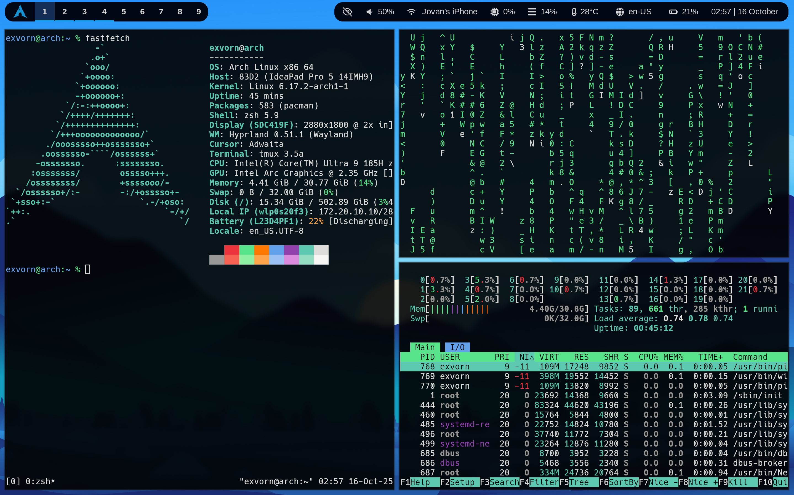
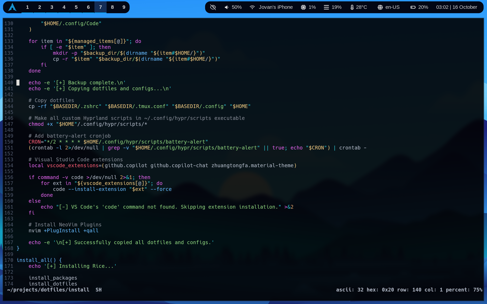
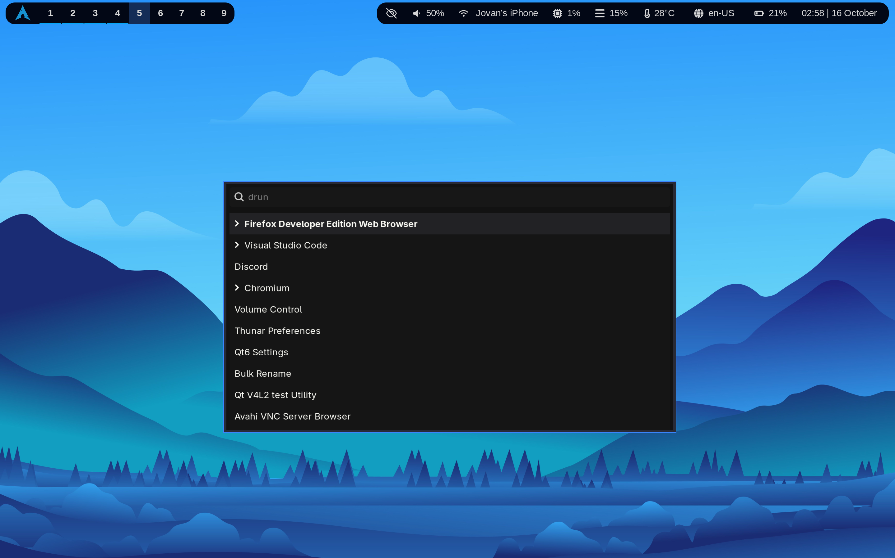

# Dotfiles & Hyprland Rice Installer






## Overview

This repository contains curated dotfiles and a comprehensive installation script for ricing and configuring a Hyprland-based Arch Linux environment. The setup is designed for minimalism, aesthetics, and productivity, automating the deployment of essential packages, configs, themes, and customizations for your window manager, terminal, and development tools.

## Features

- Automated installation of recommended packages for Hyprland, terminal, and productivity
- Backup and deployment of dotfiles and configs for Hyprland, Kitty, NeoVim, Waybar, Wofi, and more
- Desktop and CLI integration for a seamless workflow
- Service management for essential system and user services
- Visual Studio Code and NeoVim plugin setup
- Safe backup of existing configs before overwriting

## Installation

Clone the repository and run the installer:

```sh
git clone https://github.com/exvorn/dotfiles.git
cd dotfiles
chmod +x install
./install --all
```

### Options

- `--packages`   Install recommended packages only
- `--dotfiles`   Install dotfiles and configs only
- `--all`        Run full setup (recommended)
- `--help`       Show help message

> **Note:** Existing configs will be backed up to `~/.dotfiles-backup/YYYYMMDDHHMMSS`. Review the script before running if you have custom settings.

## Requirements

- Arch Linux or derivative
- Internet connection
- Sudo privileges (for package installation)

## Author

Created & maintained by [Jovan Bogovac](https://github.com/exvorn)

## Contributing

Contributions are welcome! Please open an issue or submit a pull request for improvements, bug fixes, or new features.

## License

This project is licensed under the [Apache License 2.0](LICENSE).

---

For more details, see the `install` script and explore the configs in `.config/`.